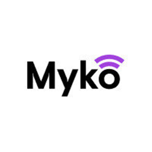

<p align="center">
  
</p>

<h1 align="center">Myko+ pour Home Assistant</h1>

<p align="center">
  Pilotez vos appareils connectés <b>Myko+</b> (Kingfisher — B&Q, Castorama,
  Screwfix) directement dans Home Assistant.
</p>

<p align="center">
  <a href="https://hacs.xyz/"></a>
  
  <a href="https://github.com/Flybrow/mykoplus-homeassistant/actions/workflows/validate.yml"></a>
  <a href="LICENSE"></a>
</p>

Cette intégration se connecte au cloud Myko+ avec vos identifiants de
l'application mobile et expose vos appareils dans Home Assistant. Aucune
modification du matériel n'est nécessaire (co-marques *GoodHome* / *Jacobsen*
incluses).

## Fonctionnalités

- 🔌 Connexion par e-mail / mot de passe du compte Myko+.
- 🔎 Découverte automatique des appareils de toutes vos maisons.
- ⚡ **Mises à jour en temps réel** (push) de l'état des appareils.
- ♻️ Reconnexion automatique en cas d'expiration de session.

## Appareils pris en charge

| Type | Entité Home Assistant | État |
|------|-----------------------|------|
| Prise connectée | `switch` (marche/arrêt) + `switch` « Voyant LED » | ✅ pris en charge |
| Lumière variable | `light` | 🧪 expérimental |
| Radiateur / thermostat | `climate` | 🧪 expérimental |
| Capteurs (température, batterie, humidité) | `sensor` | 🧪 expérimental |

Les types 🧪 sont implémentés mais pas encore validés sur du matériel réel — les
entités n'apparaissent que si l'appareil expose les informations correspondantes.
Vous possédez un de ces appareils ? Voir [Aider à intégrer vos
appareils](#aider-à-intégrer-vos-appareils).

## Installation

### Via HACS (recommandé)

[](https://my.home-assistant.io/redirect/hacs_repository/?owner=Flybrow&repository=mykoplus-homeassistant&category=integration)

1. HACS → menu (⋮) → **Dépôts personnalisés**.
2. Ajouter `https://github.com/Flybrow/mykoplus-homeassistant`, catégorie
   **Integration**.
3. Installer **Myko+**, puis redémarrer Home Assistant.

### Manuelle

Copiez le dossier `custom_components/mykoplus` dans le dossier
`config/custom_components` de votre installation, puis redémarrez.

## Configuration

1. **Paramètres → Appareils et services → Ajouter une intégration**.
2. Recherchez **Myko+**.
3. Saisissez l'**e-mail** et le **mot de passe** de votre compte Myko+.

Vos appareils apparaissent ensuite automatiquement.

## Exemple d'automatisation

Éteindre une prise tous les soirs à 23 h :

```yaml
automation:
  - alias: "Couper la prise la nuit"
    triggers:
      - trigger: time
        at: "23:00:00"
    actions:
      - action: switch.turn_off
        target:
          entity_id: switch.prise_myko
```

## Confidentialité

- Vos identifiants ne servent qu'à vous authentifier auprès du cloud Myko+ ; ils
  sont stockés par Home Assistant et **ne transitent par aucun tiers**.
- L'intégration communique uniquement avec les serveurs Myko+ (Kingfisher).

## Dépannage

- **Identifiants invalides** : vérifiez que vous pouvez vous connecter dans
  l'application mobile Myko+ avec les mêmes identifiants.
- **Appareil indisponible** : vérifiez qu'il est en ligne dans l'application
  Myko+ ; l'intégration reflète l'état du cloud.
- **Un seul appareil connecté à la fois ?** Le cloud Myko+ n'autorise qu'une
  session active : se reconnecter ailleurs peut déconnecter une autre session.

## Aider à intégrer vos appareils

Votre appareil n'est pas (bien) pris en charge ? Un petit outil exporte une
description **anonymisée** de vos appareils pour m'aider à les ajouter — sans
manipulation technique.

1. Téléchargez **MykoDiagnostics.exe** depuis la
   [dernière release](https://github.com/Flybrow/mykoplus-homeassistant/releases)
   (ou, avec Python : `python tools/myko_diagnostics.py`).
2. Lancez-le et connectez-vous (identifiants **ni enregistrés ni transmis**).
3. **Choisissez un appareil**, puis enregistrez les **actions** que vous voulez
   piloter depuis Home Assistant (allumer, régler la luminosité à 50 %, etc.).
   L'outil détecte automatiquement le réglage modifié.
4. Envoyez le fichier `myko_report.json` généré via une
   [issue](https://github.com/Flybrow/mykoplus-homeassistant/issues).

Le rapport ne contient ni mot de passe, ni jeton, ni données personnelles
(adresse, GPS, numéros de série et identifiants sont masqués).

> 💡 Certains antivirus signalent parfois (à tort) les exécutables créés avec
> PyInstaller. C'est un **faux positif** courant. En cas de doute, utilisez la
> version Python (`tools/myko_diagnostics.py`), dont le code est entièrement
> consultable.

## Avertissement

Projet communautaire **non affilié** à Kingfisher, Myko+ ou leurs partenaires.
Utilise une API non officielle, susceptible d'évoluer sans préavis. Fourni « en
l'état », sans garantie.

## Journal des modifications

Voir [CHANGELOG.md](CHANGELOG.md).

## Licence

[MIT](LICENSE)
